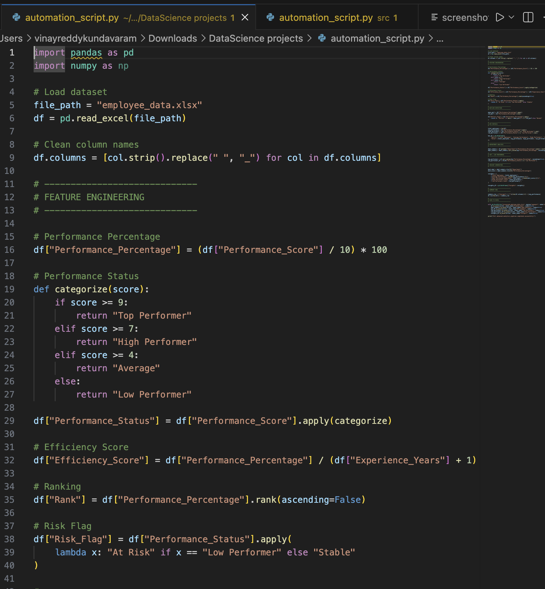
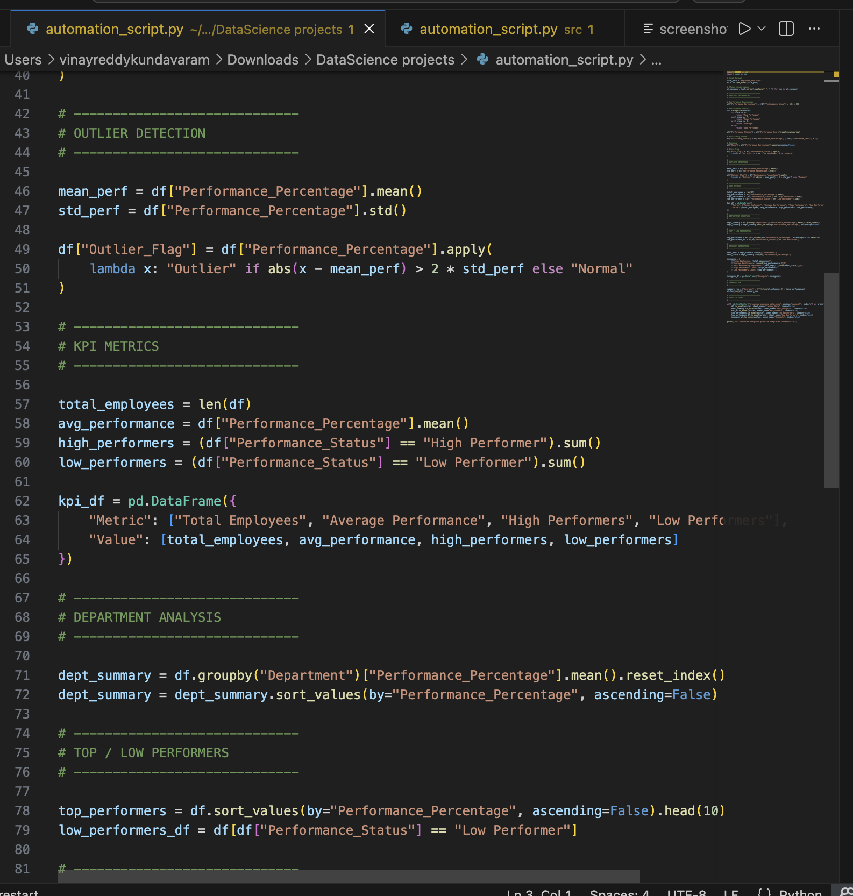
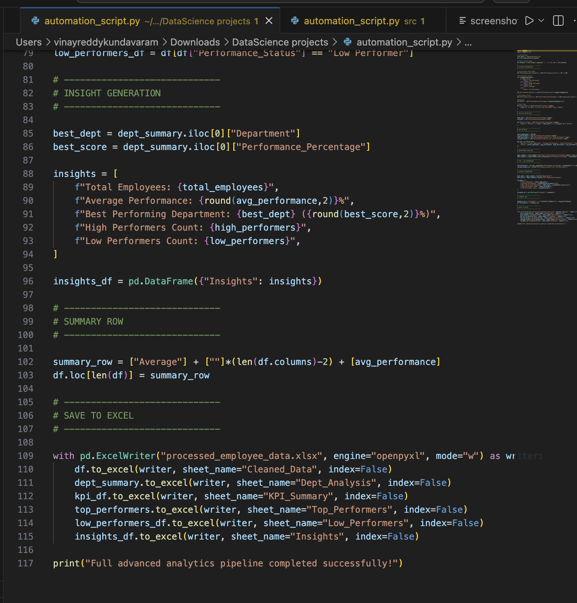
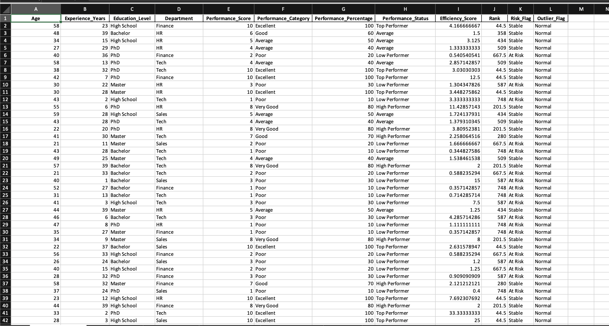
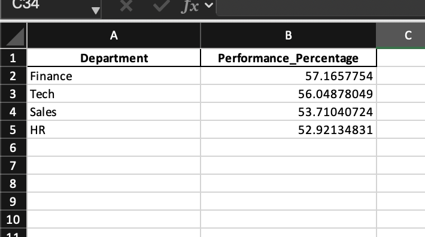
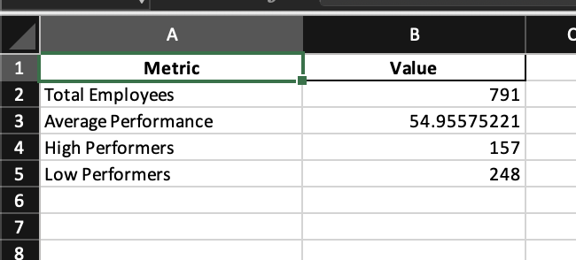
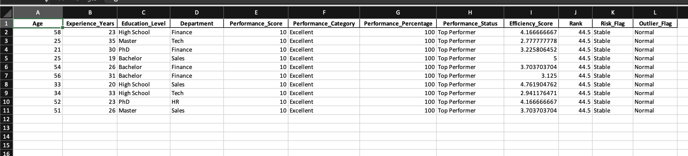
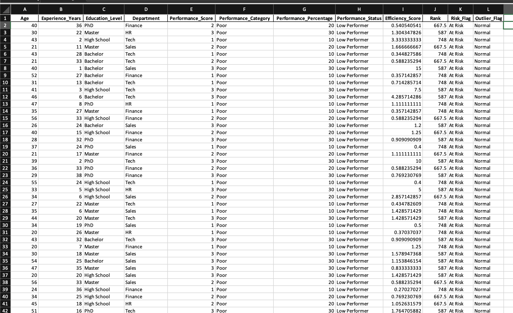
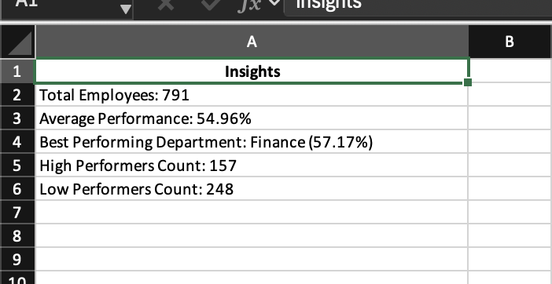
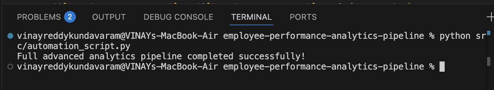

# Business Process Automation and Reporting System - Employee Performance (Python)

## Overview
This project implements a data automation pipeline using Python to process raw employee data and generate structured, analysis-ready outputs.

The script cleans, transforms, and generates multiple processed sheets automatically, reducing manual effort and improving data consistency.

---

## Problem Statement
Manual data processing in Excel is time-consuming, error-prone, and not scalable.  
This project automates the workflow to ensure faster and reliable data transformation.

---

## Solution
A Python-based automation script was developed to:

- Read raw employee data
- Clean and preprocess datasets
- Generate multiple structured output sheets
- Export processed results into a new Excel file

---

## Tech Stack
- Python
- Pandas
- Excel (XLSX processing)

## Project Structure
EMPLOYEE-PERFORMANCE-ANALYTICS-PIPELINE
│
├── data
│ └── employee_data.xlsx
│
├── output
│ └── processed_employee_data.xlsx
│
├── Screenshots
│ ├── code-a.png
│ ├── code-b.png
│ ├── code-c.png
│ ├── output-a.png
│ ├── output-b.png
│ ├── output-c.png
│ ├── output-d.png
│ ├── output-e.png
│ ├── output-f.png
│ └── Terminal-output.png
│
├── src
│ └── automation_script.py
│
└── README.md

---

## Key Features
- Automated data cleaning and transformation
- Multi-sheet output generation
- Scalable and reusable pipeline
- Reduces manual Excel work significantly

---

## Output
The script generates a processed Excel file containing multiple sheets with structured employee data.

Additional outputs are available in the **detailed_outputs** folder for verification.

---
## Screenshots

### Code Execution

  
  

---

### Output Generated (Excel Sheets)

  
  
  
  
  

---

### Terminal Execution

---

## How to Run
1. Clone the repository
2. Install required libraries:

